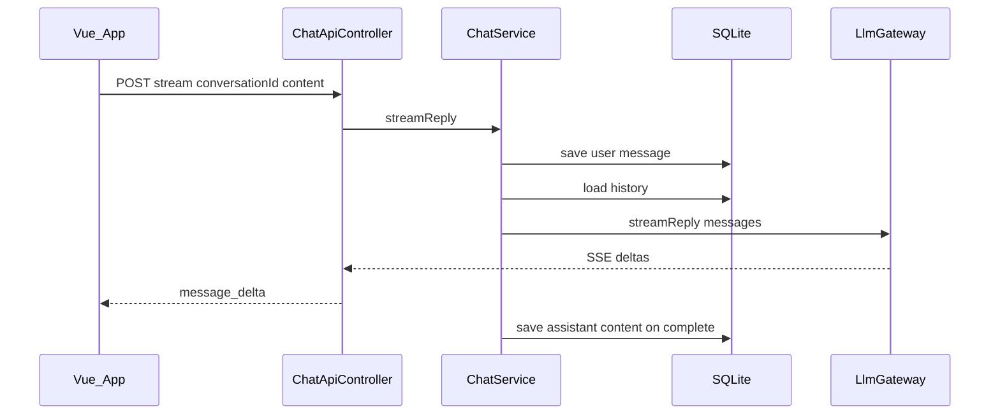

# HAL1000：现状功能与后续补充项

本文档描述当前代码库已实现的能力、HTTP API、局限与已知工程差异，并列出可后续补充的功能方向（优先级需产品与研发团队共同确认）。

---

## 一、当前已实现功能

### 1. 产品 / 用户可见能力

- **单页聊天**（[`frontend/src/App.vue`](../frontend/src/App.vue)）：侧边栏会话列表、新建会话、切换会话、主区域消息气泡、输入框与发送；流式回复时禁用发送；加载与错误中文提示；在非安全上下文（`window.isSecureContext === false`）下对 `crypto.randomUUID` 做降级，避免运行时崩溃。若后端启用 RAG（`GET /api/conversations/{id}/documents` 非 404），侧栏显示 **知识库**：上传 `.txt`/`.md`/`.pdf`、提交 URL、列出与删除已索引文档。
- **无客户端路由**：未使用 `vue-router`，单页由 [`SpaForwardController`](../src/main/java/com/genhao/hal1000/chat/web/SpaForwardController.java) 将 `/`、`/chat`、`/conversations` 转发到 `index.html`，便于日后接入前端路由；当前 UI 不依赖 URL 路径。

### 2. HTTP API

基路径：`/api`。实现见 [`ChatApiController`](../src/main/java/com/genhao/hal1000/chat/web/ChatApiController.java)。

| 方法 | 路径 | 作用 |
|------|------|------|
| `POST` | `/api/conversations` | 创建会话，返回会话实体 JSON（含 `id`、`title`、`userId`、`createdAt`、`updatedAt` 等字段） |
| `GET` | `/api/conversations` | 列出全部会话；[`ChatService.listConversations`](../src/main/java/com/genhao/hal1000/chat/service/ChatService.java) 按 `updatedAt` 降序排序 |
| `GET` | `/api/conversations/{id}/messages` | 返回该会话消息列表：每条含 `id`、`role`、`content`、`model`、`promptTokens`、`completionTokens`、`totalTokens`、`createdAt` |
| `POST` | `/api/conversations/{id}/stream` | **SSE**（`Content-Type: text/event-stream`），请求体：`{ "content": "用户输入" }`。服务端推送 JSON：`type` 为 `message_delta` 时含 `delta` 文本片段；`type` 为 `error` 时含 `error` 友好信息；流结束前发送字面量 `[DONE]` |

当 `hal1000.rag.enabled=true` 时，另见 [`RagApiController`](../src/main/java/com/genhao/hal1000/rag/web/RagApiController.java)（未启用 RAG 时这些路由不存在，前端 `GET .../documents` 会得到 **404**）：

| 方法 | 路径 | 作用 |
|------|------|------|
| `POST` | `/api/conversations/{id}/documents` | `multipart/form-data`，字段 `file`：上传 `text/plain`、`text/markdown` 或 `application/pdf`（[`PdfTextExtractor`](../src/main/java/com/genhao/hal1000/rag/util/PdfTextExtractor.java)，Apache PDFBox） |
| `POST` | `/api/conversations/{id}/documents/from-url` | JSON `{"url":"https://..."}`，仅允许 http/https；HTML 响应用 Jsoup 抽取正文 |
| `GET` | `/api/conversations/{id}/documents` | 列出该会话已索引文档（含 `chunkCount` 等） |
| `DELETE` | `/api/conversations/{id}/documents/{docId}` | 删除文档及其向量块 |

### 3. 对话与持久化

- **SQLite + Liquibase**：数据源见 [`application.yaml`](../src/main/resources/application.yaml)（`jdbc:sqlite:${HAL1000_DB_PATH:./hal1000.db}`）；表结构由 [`db/changelog`](../src/main/resources/db/changelog/) 管理，`ddl-auto` 为 `none`。
- **会话**（[`ChatConversationEntity`](../src/main/java/com/genhao/hal1000/persistence/entity/ChatConversationEntity.java)）：数据库层有 `title`、`user_id` 字段；当前 [`createConversation`](../src/main/java/com/genhao/hal1000/chat/service/ChatService.java) 将二者置为 `null`，**无会话重命名、无多用户隔离**。
- **消息**（[`ChatMessageEntity`](../src/main/java/com/genhao/hal1000/persistence/entity/ChatMessageEntity.java)）：用户消息先落库，再按**完整历史**组装为 LLM 上下文；助手消息先以空内容占位保存，流式结束后写回拼接全文。实体含 `model` 与各 token 字段，但当前流式路径**未**对 `model` / `prompt_tokens` / `completion_tokens` / `total_tokens` 赋值，API 返回中这些字段多为 `null`。

### 4. LLM 集成

- **配置**（`hal1000.llm`）：[`application.yaml`](../src/main/resources/application.yaml) 中 `provider`、`base-url`、`api-key`、`model`、`timeout-seconds`；环境变量示例见 [`.env.example`](../.env.example)。
- **网关选择**（[`LlmConfig`](../src/main/java/com/genhao/hal1000/llm/LlmConfig.java)）：`HAL1000_LLM_PROVIDER` 为 `gemini` 时使用 [`GeminiAiStudioGateway`](../src/main/java/com/genhao/hal1000/llm/GeminiAiStudioGateway.java)（Google Generative Language API，`streamGenerateContent`）；为 `openai` 或未配置时使用 [`OpenAiCompatGateway`](../src/main/java/com/genhao/hal1000/llm/OpenAiCompatGateway.java)（OpenAI 兼容 `/v1/chat/completions` 流式）；其他值时回退到 OpenAI 兼容实现。
- **可观测性**：[`RequestMetrics`](../src/main/java/com/genhao/hal1000/chat/service/RequestMetrics.java) 在流式完成或失败时记录延迟、首 token 等并打日志；**未**将 token 用量写回消息表。

### 5. RAG（可选，`hal1000.rag.enabled=true`）

- **接口**：[`ContextAugmentor.augmentSystemPrompt(conversationId, userQuery)`](../src/main/java/com/genhao/hal1000/rag/ContextAugmentor.java)；未启用 RAG 时由 [`NoopContextAugmentor`](../src/main/java/com/genhao/hal1000/rag/NoopContextAugmentor.java) 返回空串。
- **启用时**：[`VectorRagContextAugmentor`](../src/main/java/com/genhao/hal1000/rag/VectorRagContextAugmentor.java) 按会话从表 `rag_chunk` 加载向量，对用户当前句做 **embedding**，**余弦相似度 Top‑K**，将带 `[1]`… 编号与文档名的摘录写入额外 **system** 消息，并要求模型在回答中用相同编号引用。
- **入库**：[`RagIngestionService`](../src/main/java/com/genhao/hal1000/rag/RagIngestionService.java) 分块（字符窗口 + 重叠，见 `hal1000.rag.chunk-*`），经 [`EmbeddingClient`](../src/main/java/com/genhao/hal1000/rag/embedding/EmbeddingClient.java) 实现（`openai` → `/v1/embeddings`，`gemini` → Generative Language `embedContent` / `batchEmbedContents`）写入 **float32 小端 BLOB**。
- **配置**：[`application.yaml`](../src/main/resources/application.yaml) 中 `hal1000.rag.*`；`embedding-base-url` / `embedding-api-key` 为空时回退到 `hal1000.llm`；**启用 RAG 时必须配置可用的 embedding 密钥**（与聊天 provider 可不同）。
- **局限（当前迭代）**：PDF 仅提取**可选中文本层**（扫描版/纯图 PDF 可能无字可抽）；URL 入库在 `Content-Type` 或路径含 `.pdf` 时同样走 PDF 解析；索引为**同步**；无 SSE 返回「本次引用列表」；仅会话级知识库；若更换 embedding 模型维度，旧块与查询向量维度不一致时会被跳过。

### 6. 安全与鉴权

- 依赖中**无** Spring Security；REST **无认证与授权**，能访问服务端的调用方可操作全部会话数据。

### 7. 部署与运维（详见仓库内文档）

- 容器与构建：[`Dockerfile`](../Dockerfile)、[`docker-compose.yml`](../docker-compose.yml)（若存在）。
- 运维说明：[`DEPLOY_DEBIAN12_DOCKER.md`](../DEPLOY_DEBIAN12_DOCKER.md)、[`REVERSE_PROXY.md`](../REVERSE_PROXY.md)（数据卷、`HAL1000_DB_PATH`、反向代理等）。

### 8. 测试

- 仅存在 [`Hal1000ApplicationTests`](../src/test/java/com/genhao/hal1000/Hal1000ApplicationTests.java) 类；**无**针对 Chat API 或 LLM 的集成测试。

### 9. 已知工程差异（构建输出路径）

以下事实并存，本地与 Docker 构建时请留意产物位置：

| 来源 | 静态资源期望位置 |
|------|------------------|
| [`build.gradle`](../build.gradle) `frontendBuild` | `frontend` 构建输出到项目根下 `src/main/resources/static`（由 `npm run build` 与 Vite 配置共同决定） |
| [`frontend/vite.config.ts`](../frontend/vite.config.ts) | `build.outDir` 为 `../src/main/resources/static` |
| [`Dockerfile`](../Dockerfile) 前端阶段 | `npm run build` 后从 `/app/frontend/dist/` 拷贝到后端 `src/main/resources/static` |

Vite 默认在 `outDir` 下生成文件；若 `outDir` 指向非 `frontend/dist`，则 Docker 中 `COPY --from=frontend /app/frontend/dist/` 可能与实际输出不一致。**以你本地与 CI 实际使用的构建命令为准**；若出现空白页或旧资源，请核对上述路径。

---

## 二、后续可补充功能（待排期）

以下为增强方向，**优先级需产品与研发团队共同确认**后再拆用户故事。

**产品与交互**

- 会话 **重命名**、**删除**（单条或批量）；会话列表 **分页或搜索**（会话量增大时）。
- **停止生成**（取消 SSE / 中止流）与 **重试上一条**。
- **系统提示词 / 每会话参数**（温度、模型切换等），尤其在多模型并存时。
- 助手消息 **Markdown / 代码高亮** 渲染（可选）。

**多用户与权限**

- 利用已有 `user_id`：**登录**（OIDC / Session / JWT 等）与 **按用户隔离会话**、API 级授权。

**可观测与成本**

- 从流式响应解析 **usage**，写入消息的 token 字段；简单 **用量统计** 或仪表盘。

**可靠性与运维**

- 统一 **Vite `outDir`、Gradle、`Dockerfile` COPY**（若纳入迭代）；**健康检查**、结构化日志、**请求限流**（防滥用）。

**工程化**

- API **契约测试**（如 `MockMvc` / WebTestClient）、`ChatService` 单元测试；前端拆分与 **E2E**（如 Playwright）视投入而定。

---

## 三、请求与流式回复数据流（示意）

